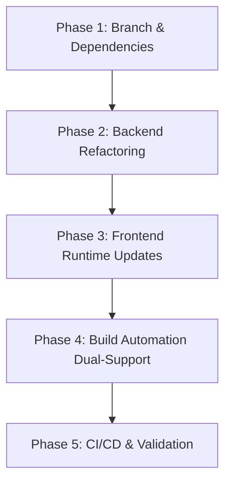

# Wails v2 to Wails v3 Migration Plan

This document details the migration roadmap and architectural changes required to upgrade **GoExcelImageImporter** from **Wails v2** (`v2.11.0`) to **Wails v3 Beta** (`github.com/wailsapp/wails/v3`).

---

## 📌 Context & Objectives

- **Current Stack**: Wails v2.11.0, Go 1.25.6, Vanilla HTML/CSS/JS (no bundler), Excelize v2.10.0.
- **Target Stack**: Wails v3 Beta, Go 1.25.6, Vanilla HTML/CSS/JS, Excelize v2.10.0.
- **Goals**:
  1. Migrate cleanly to the Wails v3 application and service architecture.
  2. Maintain strict 1:1 feature parity with zero downtime/breakage for existing v2 production releases.
  3. Introduce Wails v3 native **Single Instance** handling to protect Excel files from multiple concurrent process locks.
  4. Preserve a lightweight frontend without introducing Node.js/npm dependencies.
  5. Provide dual build support (`Taskfile.yml` and `Makefile`) and update GitHub Actions CI/CD workflows.

---

## 🎯 Key Architectural Decisions

| Area | Decision | Details |
| :--- | :--- | :--- |
| **Git Workflow** | Dedicated Branch (`feature/wails-v3`) | Work on an isolated branch to allow iterative testing without affecting `main`. |
| **Frontend Stack** | Vanilla JS (No Bundler) | Continue using raw HTML/CSS/JS in `frontend/dist/` without `npm` or bundlers, interfacing with Wails v3 injected runtime/bindings. |
| **Build Automation** | Dual Support (`Taskfile.yml` + `Makefile`) | Add Wails v3 standard `Taskfile.yml` while updating `Makefile` targets to wrap `wails3` commands. |
| **Feature Scope** | 1:1 Parity + Single Instance | Keep exact UI/behavior; enable native Single Instance protection (`UniqueId`). |
| **CI/CD Pipeline** | Immediate CI Migration | Update `.github/workflows/ci.yml` and `release.yml` on the migration branch to use `wails3` toolchain. |

---

## 🗺️ Migration Phases



---

### Phase 1: Git Branching & Dependencies

1. **Create Branch**:

   ```bash
   git checkout -b feature/wails-v3
   ```

2. **Install Wails v3 CLI**:

   ```bash
   go install github.com/wailsapp/wails/v3/cmd/wails3@latest
   wails3 doctor
   ```

3. **Update `go.mod`**:
   - Replace `github.com/wailsapp/wails/v2` with `github.com/wailsapp/wails/v3`.
   - Run `go mod tidy`.

---

### Phase 2: Backend Architecture Refactoring

#### 1. `main.go`

- Replace monolithic `wails.Run(&options.App{...})` with `application.New(application.Options{...})`.
- Register the `App` instance as a service via `application.NewService(app)`.
- Configure Single Instance protection and asset server:

  ```go
  app := application.New(application.Options{
      Name:        "GoExcelImageImporter",
      Description: "Image to Excel Importer",
      Services: []application.Service{
          application.NewService(appService),
      },
      Assets: application.AssetOptions{
          Handler: application.AssetFileServerFS(assets),
      },
      SingleInstance: &application.SingleInstanceOptions{
          UniqueId: "com.hoangtran.goexcelimageimporter",
      },
  })

  app.NewWebviewWindowWithOptions(application.WebviewWindowOptions{
      Title:         "Image to Excel Importer",
      Width:         900,
      Height:        835,
      DisableResize: true,
      MinWidth:      700,
      MinHeight:     600,
      BackgroundColour: application.NewRGB(27, 38, 54),
  })

  err := app.Run()
  ```

#### 2. `app.go`

- Store `*application.App` reference in `App` struct.
- Migrate Dialogs from v2 runtime:
  - `runtime.OpenFileDialog(ctx, ...)` -> `application.OpenFileDialog().AddFilter("Excel Files (*.xlsx)", "*.xlsx").PromptForSingleSelection()`
  - `runtime.OpenDirectoryDialog(ctx, ...)` -> `application.OpenDirectoryDialog().PromptForSingleSelection()`
- Migrate Events:
  - `runtime.EventsEmit(ctx, "progress", ...)` -> `a.app.EmitEvent("progress", progress*100)`.

#### 3. `updater.go`

- Replace `runtime.EventsEmit` with `a.app.EmitEvent("updateProgress", message)`.
- Replace `runtime.Quit(ctx)` with `a.app.Quit()`.
- Semantic version comparison (`CompareVersions`) and batch script mechanism remain unchanged.

#### 4. `internal/engine/`

- Zero changes needed. `internal/engine/processor.go` is decoupled from Wails and uses standard Go context and Excelize.

---

### Phase 3: Frontend Runtime & Event Updates

1. **`frontend/dist/index.html`**:
   - Ensure the Wails v3 runtime script is loaded (e.g., `/wails/runtime.js`).
2. **`frontend/dist/app.js`**:
   - Replace v2 event listeners:
     - Old: `runtime.EventsOn('progress', callback)`
     - New: `wails.Events.On('progress', callback)`
   - Replace backend call syntax:
     - Old: `window.go.main.App.<Method>(...)`
     - New: Adjust to v3 window bindings or `wails.Call(...)` based on generated runtime.

---

### Phase 4: Build System & Automation

1. **`Taskfile.yml`**:
   - Create standard Wails v3 `Taskfile.yml` defining `build`, `dev`, and `package` targets.
2. **`Makefile`**:
   - Update `build`, `build-windows`, `build-release`, and `deps` to invoke `wails3 build` or `task build`.
   - Preserve existing `test`, `coverage`, `lint`, and `clean` targets.
3. **`wails.json`**:
   - Update configuration to match Wails v3 schema.

---

### Phase 5: CI/CD Pipeline & Verification

1. **GitHub Actions Workflows**:
   - `.github/workflows/ci.yml`: Update toolchain step to install `github.com/wailsapp/wails/v3/cmd/wails3@latest` and run `wails3 build`.
   - `.github/workflows/release.yml`: Ensure tag-based releases compile with `-ldflags` version injection and package the resulting binary artifact correctly.
2. **Verification Checklist**:
   - [ ] Unit tests pass: `go test -v ./internal/engine ./`
   - [ ] Linter clean: `golangci-lint run`
   - [ ] Native compilation successful on Windows (`tool_chen_anh.exe`).
   - [ ] Excel selection and sheet extraction verified.
   - [ ] Image folder selection and batch processing verified.
   - [ ] Real-time progress bar updates smoothly.
   - [ ] Auto-update check functions correctly.
   - [ ] Second app instance focuses the existing window (Single Instance test).
